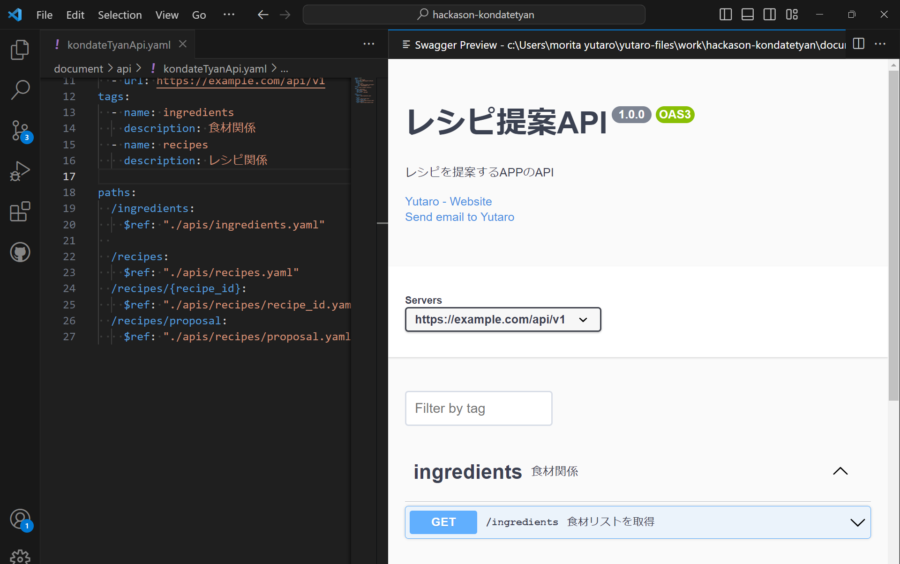

# Swaggerについてと使い方

## Swaggerとは

Swagger UIは、Web APIのドキュメントを表示するためのオープンソースのユーザーインターフェース（UI）です。Swagger UIは、Swagger（現在は OpenAPI Specificationとして知られる）と呼ばれるAPI設計ツールの一部であり、APIの仕様書を視覚的かつインタラクティブな形式で表示することができます。

cf: [Swagger UI とは](https://apidog.com/jp/blog/how-to-use-swagger-ui/)

## VSCODE でSwaggerで書いたAPIをプレビューする方法

### 必要な拡張機能

下記２つ(見るだけならSwagger ViewerだけでOK)をインストール

#### Swagger Viewer

Swaggerを表示するための拡張機能

■ 拡張機能情報
Name: Swagger Viewer
Id: Arjun.swagger-viewer
Description: Swagger Viewer lets you preview and validate Swagger 2.0 and OpenAPI files as you type in Visual Studio Code.
Version: 3.1.2
Publisher: Arjun G
VS Marketplace Link: https://marketplace.visualstudio.com/items?itemName=Arjun.swagger-viewer

#### Spectral

Swaggerを編集する際に文法ミスを指摘してくれる拡張機能
（Swaggerを見るだけなら不要）

■ 拡張機能情報
Name: Spectral
Id: stoplight.spectral
Description: JSON/YAML linter with OpenAPI and custom ruleset support.
Version: 1.1.2
Publisher: Stoplight
VS Marketplace Link: https://marketplace.visualstudio.com/items?itemName=stoplight.spectral

### プレビュー方法

上記の拡張機能をインストールした上、Swagger 記法で書かれた `.yaml` のファイルを開き、
`Shift + Alt + P` でプレビュー画面が開く

## Swaggerで書いた`.yaml`を`.html`に変換する

- node.jsを使用する

参考サイト : [SwaggerでOpenAPI仕様書を作成、HTMLやMarkdownに変換する](https://zenn.dev/dozo/articles/1e0f542ea59244)

■ 手順
1. node.jsは入っている前提
2. `npm i -D redoc-cli`
3. `npx redoc-cli build reference/User.yaml -o dist/User.html` 
   ファイル名は適せん変更。一つ目が変換元のyamlファイル。二つ目が出力のhtmlファイル

■ 補足
- 現在は`backend/apis`ディレクトリ内で簡単に実行できるように設定してある
    1. 上記ディレクトリ内で`npm i` (初めに一度だけ)
    2. 以降htmlに変換したい度に、`npm run creat-api` で変換される
    3. 出力先は `document/api/output/api.html`